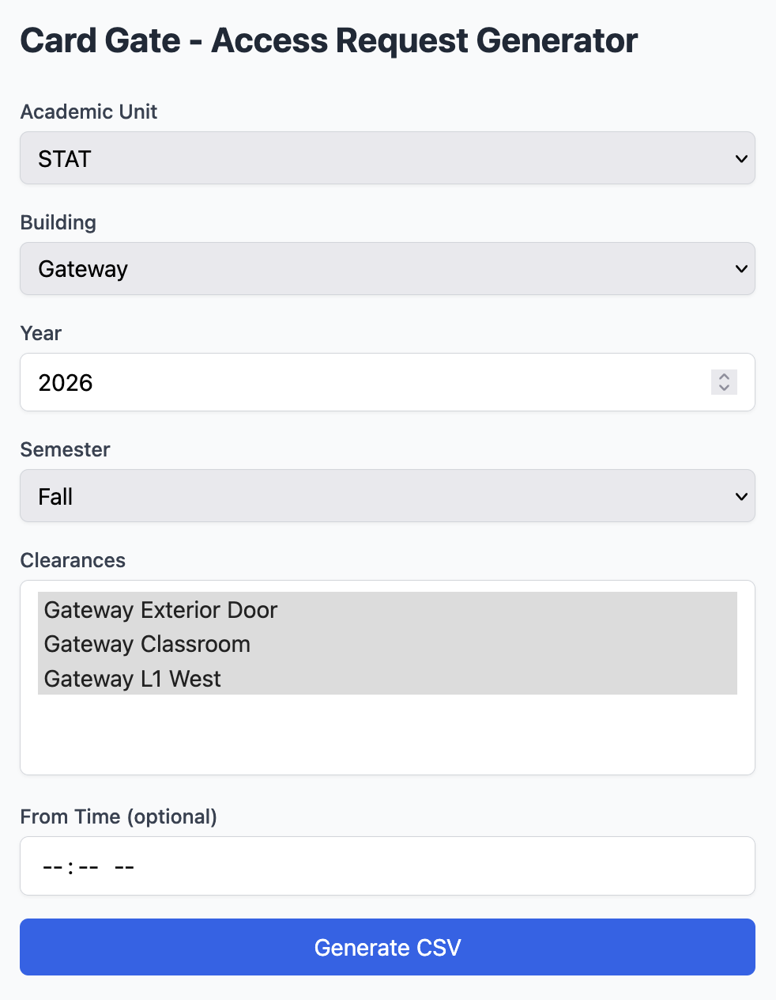

The web UI provides a browser-based form for generating card key access CSVs without using the CLI.

## Form Fields

| Field | Description |
|-------|-------------|
| **Academic Unit** | Dropdown of configured departments. Select "Other" to type a custom code. |
| **Building** | Dropdown of configured buildings. Select "Other" to type a custom name. |
| **Year** | The academic year (e.g., 2026). Defaults to the current year. |
| **Semester** | Spring, summer, or fall. |
| **Clearances** | Multi-select list of clearance locations from `cardgate.yaml`. All are selected by default; deselect any to omit them from the output. |
| **From Time** | Optional time filter — only course sections starting at or after this time (24h format, e.g. `18:00`) are included. |

## Output

The form generates the same CSV format as the CLI (see [CSV Output](index.md#csv-output)) and downloads it automatically.
